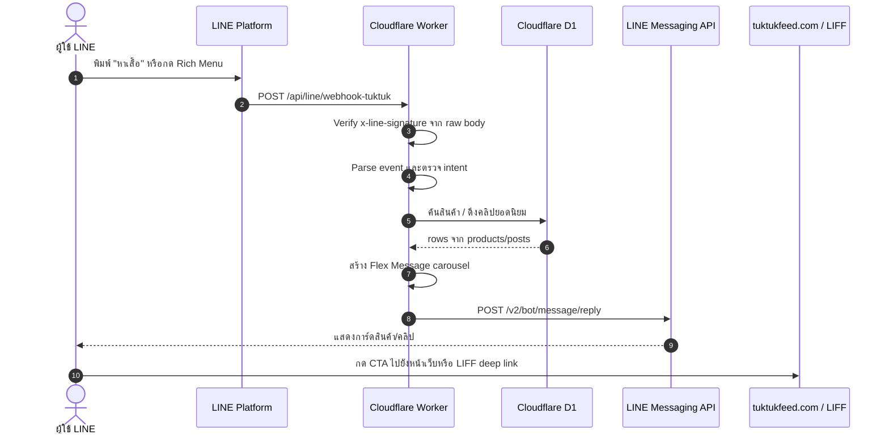

# แผนพัฒนา LINE Features สำหรับ TukTuk Feed

สถานะตรวจสอบล่าสุด: 2026-07-07

เอกสารนี้เป็นแผนพัฒนาฟีเจอร์ LINE OA/LIFF ที่อ้างอิงจากโค้ดและ schema ปัจจุบันของโปรเจ็ค `D:\1_Developer\Flutterapp\caculateapp` เพื่อใช้พัฒนาต่อได้จริง ไม่ใช่แค่แนวคิดระดับสูง

---

## 1. สรุปผลตรวจจากระบบปัจจุบัน

### สิ่งที่มีแล้ว

| ส่วน | สถานะจริงใน repo |
| :--- | :--- |
| Cloudflare Worker API | มี entry point ที่ `workers/index.js` |
| LINE webhook handler | มีที่ `workers/handlers/line-webhook.js` |
| Webhook route จริง | `/api/line/webhook` และ `/api/line/webhook-tuktuk` |
| Reply Message utility | มี `replyToLine()` แล้ว |
| Web PIN login | มี flow สร้าง PIN จาก LINE และ login ผ่าน `/api/v1/auth/session` provider `line_pin` |
| LINE OAuth login | React app ใช้ `/app/login` และ provider `line_oauth` |
| D1 products/posts | มี schema ใน `workers/migrations/001_init.sql` และ field เพิ่มเติมใน `004_product_and_post_fields.sql` |
| LIFF config | มี `public/js/liff-config.js` พร้อม LIFF ID หลัก |
| Cron trigger | มี config ใน `workers/wrangler.toml` และ handler `scheduled()` ใน `workers/index.js` |

### จุดที่ต้องแก้ก่อนพัฒนา

| ประเด็น | ปัญหา | แนวแก้ |
| :--- | :--- | :--- |
| Webhook URL ใน plan เดิม | ระบุ `/api/webhook/line` แต่ route จริงไม่มี | ใช้ `/api/line/webhook-tuktuk` สำหรับ TukTuk OA |
| Signature verification | handler อ่าน `c.req.json()` ก่อนตรวจลายเซ็น และยังไม่ verify `x-line-signature` | อ่าน raw body ก่อน parse แล้ว verify HMAC-SHA256 |
| Query field ผิด | plan เดิมใช้ `name`, `image_url`, `view_count` | ใช้ `title`, `images`, `views_count` |
| Video query | plan เดิมพึ่ง `published/video_embed` อย่างเดียว | ใช้ `status='active'`, `published=1`, และตรวจ `media_urls`/`video_embed`/`youtube_url` |
| Broadcast | ยังไม่มีฐานข้อมูล opt-in/follower หรือ logic broadcast | เริ่มจาก Rich Menu reply ก่อน แล้วค่อยเพิ่ม broadcast |
| Secret management | auth handler มี fallback secret/channel secret ในโค้ด | ย้ายเป็น `wrangler secret` เท่านั้น |
| View count | ยังไม่เห็น endpoint เพิ่ม `views_count` เมื่อเปิดสินค้า/โพสต์ | เพิ่ม tracking หรือ increment endpoint ก่อนใช้ ranking จริงจัง |

---

## 2. Architecture เป้าหมาย



---

## 3. Endpoint และ Environment ที่ใช้จริง

### Webhook URL

แนะนำใช้ custom domain ที่จำง่าย:

```text
https://tuktukfeed.com/api/line/webhook-tuktuk
```

fallback กรณีต้องยิง Worker ตรง:

```text
https://tuktukfeed-api.imtthailand2019.workers.dev/api/line/webhook-tuktuk
```

route อื่นที่มีอยู่:

```text
/api/line/webhook          ใช้กับ LINE bot ฝั่ง injection/legacy
/api/line/webhook-tuktuk   ใช้กับ TukTuk Feed LINE OA
```

### Secrets ที่ต้องมีใน Cloudflare Worker

```text
TUKTUK_CHANNEL_ACCESS_TOKEN
TUKTUK_CHANNEL_SECRET
LINE_CHANNEL_ID
LINE_CHANNEL_SECRET
JWT_SECRET
```

หมายเหตุ: ห้ามเก็บ channel secret/token เป็น fallback ใน source code

---

## 4. Data Model ที่ใช้จริง

### products

field สำคัญ:

```text
id, seller_id, title, description, price, images, category, status,
views_count, created_at, updated_at,
seller_phone, seller_line_id, seller_facebook, seller_location,
product_unit, product_stock, is_otop, is_organic, video_url
```

`images` เป็น JSON array เช่น `["https://..."]`

### posts

field สำคัญ:

```text
id, user_id, content, media_urls, category, status,
likes_count, comments_count, views_count, created_at, updated_at,
title, youtube_url, video_embed, linked_product_id,
product_name, product_price, product_thumb, pinned, published
```

`media_urls` เป็น JSON array ที่อาจมี object เช่น:

```json
[{ "url": "https://...", "type": "video" }]
```

---

## 5. Query ที่ควรใช้

### ค้นหาสินค้า

```sql
SELECT
  p.id,
  p.title,
  p.description,
  p.price,
  p.images,
  p.category,
  p.views_count,
  p.created_at,
  u.display_name AS seller_name,
  u.picture_url AS seller_picture
FROM products p
LEFT JOIN users u ON u.id = p.seller_id
WHERE p.status = 'active'
  AND (
    p.title LIKE ?
    OR p.description LIKE ?
    OR p.category LIKE ?
  )
ORDER BY p.views_count DESC, p.created_at DESC
LIMIT ?;
```

bind:

```text
%keyword%, %keyword%, %keyword%, 10
```

### สินค้ายอดนิยม

```sql
SELECT
  p.id,
  p.title,
  p.description,
  p.price,
  p.images,
  p.category,
  p.views_count,
  u.display_name AS seller_name
FROM products p
LEFT JOIN users u ON u.id = p.seller_id
WHERE p.status = 'active'
ORDER BY p.views_count DESC, p.created_at DESC
LIMIT 10;
```

### คลิปยอดนิยม

MVP ใช้ `LIKE` กับ JSON ก่อน เพื่อไม่ต้อง migration เพิ่ม:

```sql
SELECT
  id,
  title,
  content,
  media_urls,
  category,
  likes_count,
  comments_count,
  views_count,
  video_embed,
  youtube_url,
  created_at
FROM posts
WHERE status = 'active'
  AND COALESCE(published, 1) = 1
  AND (
    media_urls LIKE '%"type":"video"%'
    OR media_urls LIKE '%"type": "video"%'
    OR video_embed IS NOT NULL
    OR youtube_url IS NOT NULL
  )
ORDER BY views_count DESC, likes_count DESC, created_at DESC
LIMIT 10;
```

ระยะถัดไปควรเพิ่ม field `has_video INTEGER DEFAULT 0` และ `thumbnail_url TEXT` เพื่อ query ได้เร็วและแม่นกว่า `LIKE` ใน JSON

---

## 6. Feature Spec

### 6.1 Product Search จากห้องแชท

intent ที่รองรับ:

```text
หาเสื้อ
ค้นหา เสื้อ
ซื้อ เสื้อ
search เสื้อ
market เสื้อ
```

logic:

1. รับ message event ชนิด text
2. normalize ข้อความ: trim, lower-case, ตัด trigger word
3. ถ้า keyword ว่าง ให้ส่ง quick reply แนะนำหมวด
4. query `searchProducts(keyword)`
5. ถ้ามีสินค้า ส่ง Flex carousel
6. ถ้าไม่มีสินค้า ส่งข้อความพร้อมปุ่มเปิด marketplace

### 6.2 Trending Products

trigger:

```text
สินค้ายอดฮิต
สินค้าแนะนำ
trending products
```

หรือ postback จาก Rich Menu:

```text
action=trending_products
```

ผลลัพธ์:

ส่ง Flex carousel สินค้า 5-10 รายการ พร้อม CTA:

```text
https://tuktukfeed.com/product.html?id={productId}
```

หรือหลังเพิ่ม deep link ใน React app:

```text
https://tuktukfeed.com/app/market?product={productId}
```

### 6.3 Trending Videos

trigger:

```text
คลิปยอดนิยม
วิดีโอยอดนิยม
ดูเพลิน
trending videos
```

หรือ postback:

```text
action=trending_videos
```

ผลลัพธ์:

ส่ง Flex carousel โพสต์วิดีโอ 5-10 รายการ พร้อม CTA:

```text
https://tuktukfeed.com/app/?post={postId}
```

ถ้า React app ยังไม่รองรับ `?post=` ให้เพิ่มใน `webapp/src/pages/DuPlenFeed.jsx` ก่อนเปิดใช้จริง

### 6.4 Rich Menu

เมนูแนะนำ 6 ช่อง:

| ช่อง | Action |
| :--- | :--- |
| ดูเพลิน | URI `https://tuktukfeed.com/app/` |
| ตลาด | URI `https://tuktukfeed.com/app/market` |
| โพสต์/ปล่อยของ | URI `https://tuktukfeed.com/app/post` |
| สินค้ายอดฮิต | postback `action=trending_products` |
| คลิปยอดนิยม | postback `action=trending_videos` |
| ขอรหัสเข้าเว็บ | message `รหัส` |

ขั้นตอนตาม LINE Messaging API:

1. เตรียมภาพ Rich Menu
2. Create rich menu พร้อม tappable areas
3. Upload image
4. Set default rich menu ให้ผู้ใช้ทุกคน

ควรทำเป็น script:

```text
workers/scripts/setup-tuktuk-rich-menu.mjs
```

### 6.5 Broadcast / Push รายสัปดาห์

เริ่มใช้หลัง Rich Menu และ reply flow เสถียรแล้ว

ตัวเลือก:

1. Broadcast ไปทั้ง OA ผ่าน LINE broadcast endpoint
2. Multicast เฉพาะผู้ใช้ที่เคย interact และยินยอมรับข่าว
3. Narrowcast ตาม audience ถ้าต้องการ segment

ข้อควบคุม:

- เคารพ quota ของ LINE OA
- ต้องมี opt-out keyword เช่น `หยุดแจ้งเตือน`
- เก็บ log การส่งทุกครั้ง
- ส่งไม่เกิน 1-2 ครั้งต่อสัปดาห์ในช่วงเริ่มต้น

---

## 7. Implementation Roadmap

### Phase 0: Security และ correctness

- [ ] แก้ Webhook URL ใน LINE Developer Console เป็น `/api/line/webhook-tuktuk`
- [ ] เพิ่ม `verifyLineSignature(rawBody, signature, channelSecret)`
- [ ] แก้ handler ให้ verify raw body ก่อน `JSON.parse`
- [ ] ใช้ `TUKTUK_CHANNEL_SECRET` สำหรับ `/webhook-tuktuk`
- [ ] ถอด fallback secret/channel secret ออกจาก source code
- [ ] เพิ่ม dedupe ด้วย `webhookEventId` เก็บใน KV `SESSIONS` ระยะสั้น
- [ ] แก้ mapping typo ใน `v1.js` จาก `post.view_count` เป็น `post.views_count`

### Phase 1: Chat search และ trending reply (✅ เสร็จสมบูรณ์ - 2026-07-08)

- [x] เพิ่ม DB methods ใน `workers/lib/db.js`
  - `searchProducts(keyword, limit)`
  - `getTrendingProducts(limit)`
  - `getTrendingVideos(limit)`
- [x] เพิ่ม intent parser ใน `workers/handlers/line-webhook.js` (รองรับคำสั่ง "เมนู", "สินค้ายอดฮิต", "คลิปยอดฮิต")
- [x] เพิ่ม Flex builders (ปรับดีไซน์เป็นสไตล์ Dark-Neon สุดล้ำ)
  - `buildProductCarousel(products)` (แก้ไขข้อจำกัด layout และ `must be non-empty text` ของ LINE API)
  - `buildVideoCarousel(posts)` (อัปเกรดให้รองรับ `type: 'video'` เล่นวิดีโอจาก R2 บน LINE ได้ทันที)
  - `buildEmptySearchReply(keyword)`
  - `buildTuktukMenuFlexMessage()` (เปลี่ยนเมนูหลักจากข้อความเปล่าเป็น Flex Message)
- [x] รองรับ message trigger และ postback trigger
- [x] เพิ่มฟังก์ชันรักษาความปลอดภัย Flex Message (`safeFlexText`, `safeFlexUrl`) เพื่อป้องกันตัวอักษรพิเศษหรือช่องว่างที่ทำให้ LINE API ปฏิเสธ (400 Bad Request)

### Phase 2: Deep link และ UX

- [ ] รองรับ `product.html?id=...` ให้เสถียรบน production
- [ ] เพิ่ม deep link `https://tuktukfeed.com/app/market?product=...`
- [ ] เพิ่ม deep link `https://tuktukfeed.com/app/?post=...`
- [ ] ทดสอบเปิดผ่าน LINE in-app browser และ external browser

### Phase 3: Rich Menu

- [ ] ออกแบบภาพ rich menu ขนาดตาม LINE requirement
- [ ] สร้าง script setup rich menu
- [ ] ใช้ postback action สำหรับผลลัพธ์ที่ต้อง reply จาก bot
- [ ] ใช้ URI action สำหรับหน้าเว็บที่เปิดตรงได้
- [ ] บันทึก richMenuId ที่สร้างไว้ในเอกสาร deploy/runbook

### Phase 4: Analytics และ ranking

- [ ] เพิ่ม endpoint หรือ middleware increment `products.views_count`
- [ ] เพิ่ม endpoint หรือ middleware increment `posts.views_count`
- [ ] เพิ่ม event tracking `line_search`, `line_click_product`, `line_click_video`
- [ ] ปรับ ranking จาก view-only เป็น score:

```text
score = views_count + likes_count * 5 + comments_count * 8 + recency_boost
```

### Phase 5: Scheduled broadcast

- [ ] เพิ่ม scheduled job ดึง top products/videos
- [ ] เพิ่ม broadcast/multicast helper
- [ ] เพิ่ม opt-in/opt-out table หรือใช้ LINE audience ตามนโยบาย
- [ ] เพิ่ม delivery log
- [ ] เพิ่ม dry-run mode ก่อนส่งจริง

---

## 8. Acceptance Tests

### Local/source checks

- [ ] `node --check workers/handlers/line-webhook.js`
- [ ] `node --check workers/lib/db.js`
- [ ] Flex JSON ทุกแบบผ่าน validation shape: `type`, `altText`, `contents`
- [ ] query products/posts ใช้ field ที่มีจริงใน D1

### Worker smoke tests

- [ ] `POST /api/line/webhook-tuktuk` events ว่าง ได้ 200 OK
- [ ] request ไม่มี signature หรือ signature ผิด ได้ 401/403 และไม่ประมวลผล event
- [ ] ข้อความ `รหัส` ยังสร้าง PIN และ reply ได้
- [ ] ข้อความ `หาเสื้อ` ได้ Flex carousel หรือ empty result reply
- [ ] postback `action=trending_products` ได้ Flex carousel
- [ ] postback `action=trending_videos` ได้ Flex carousel

### Production checks

- [ ] LINE Developer Console กด Verify webhook ผ่าน
- [ ] พิมพ์ `รหัส` ใน LINE OA แล้วได้รับ PIN
- [ ] พิมพ์ `หา...` แล้วได้ผลลัพธ์ภายใน 3 วินาที
- [ ] กด CTA ในการ์ดแล้วเปิด `tuktukfeed.com` ถูกหน้า
- [ ] ไม่มี secret หรือ service-account exposed ใน `public/`

---

## 9. Files ที่ต้องแก้เมื่อเริ่มพัฒนา

```text
workers/handlers/line-webhook.js
workers/lib/db.js
workers/index.js              เฉพาะ scheduled/broadcast ถ้าจำเป็น
workers/wrangler.toml         เพิ่ม/ยืนยัน cron และ env docs
workers/scripts/setup-tuktuk-rich-menu.mjs
webapp/src/pages/DuPlenFeed.jsx
webapp/src/pages/MarketplacePage.jsx
public/product.html           ถ้ายังใช้ legacy product detail
```

---

## 10. Official LINE References

- Webhook ต้อง verify signature ก่อนประมวลผล event: https://developers.line.biz/en/docs/messaging-api/verify-webhook-signature/
- LINE webhook event และ redelivery: https://developers.line.biz/en/docs/messaging-api/receiving-messages/
- Messaging API endpoints: https://developers.line.biz/en/reference/messaging-api/
- Rich menu setup flow: https://developers.line.biz/en/docs/messaging-api/using-rich-menus/

---

## 11. ลำดับทำงานที่แนะนำตอนนี้

1. ทำ Phase 0 ก่อน เพราะเป็น security และ route correctness
2. ทำ Phase 1 เฉพาะ reply search/trending โดยยังไม่ broadcast
3. deploy และทดสอบกับ LINE OA จริง
4. ทำ Rich Menu หลังแน่ใจว่า postback/reply เสถียร
5. ค่อยเปิด broadcast หลังมี opt-in/log/quota control
